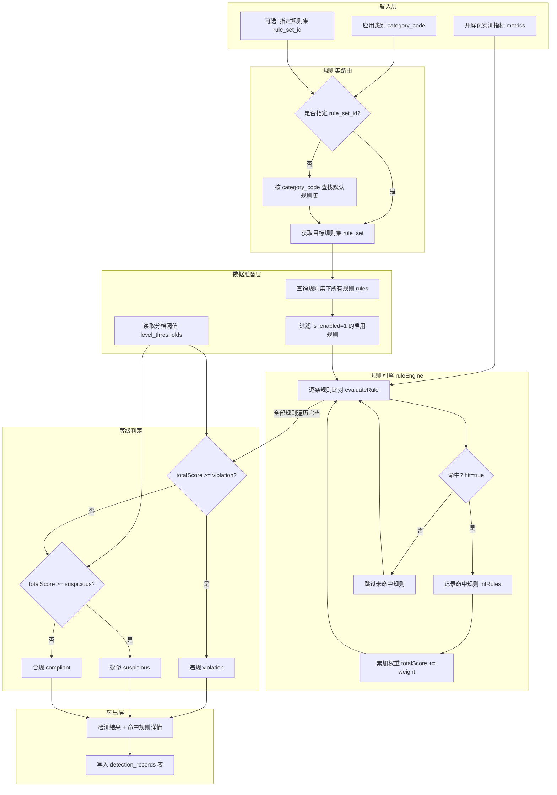
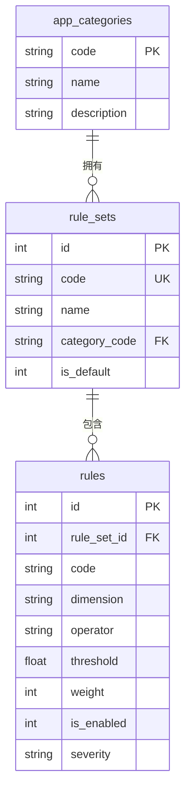
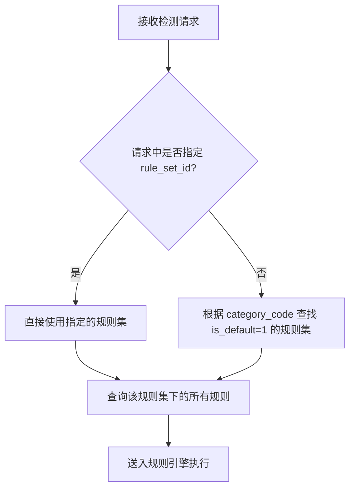
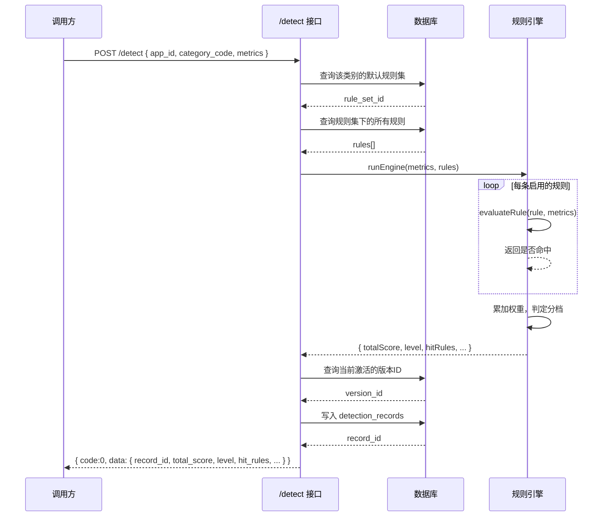

# 规则引擎评分机制深度解析

## 一、整体架构总览

RuleTrap 规则引擎是一个面向开屏广告合规检测的评分系统。运营人员可通过可视化界面自定义合规规则，引擎接收开屏页实测指标后，逐条比对规则、命中累加权重、最终输出合规分档结论。

### 核心实体关系

```
应用类别 (app_categories)
    └── 规则集 (rule_sets)  —— 每个类别有一个默认规则集
            └── 规则 (rules)  —— 每条规则含维度、操作符、阈值、权重、启停
                    └── 检测维度 (dimension)  —— 对应开屏页的某个实测指标
```

---

## 二、数据流全景图

从「开屏页实测指标」输入，到「合规/疑似/违规」分档输出的完整数据流：



---

## 三、规则的构成要素

运营自定义的每条规则，由以下核心字段组成，定义在 [rules](file:///Users/huangding/Documents/SOLOCODE%203/0612/mbp/zj-00256-ruletrap-4/src/db/database.js#L38-L55) 表中：

| 字段 | 类型 | 说明 | 示例 |
|------|------|------|------|
| `code` | string | 规则唯一编码 | `close_btn_area` |
| `name` | string | 规则名称 | 关闭按钮面积 |
| `dimension` | string | 检测维度（对应指标名） | `close_button_area_ratio` |
| `operator` | string | 比对操作符 | `lt` / `gt` / `eq` 等 |
| `threshold` | number | 判定阈值 | `0.02` |
| `weight` | integer | 权重（正整数） | `20` |
| `severity` | string | 严重级别 | `warning` / `violation` |
| `is_enabled` | integer | 启停状态（1启用/0停用） | `1` |

### 3.1 支持的检测维度

定义于 [DIMENSION_META](file:///Users/huangding/Documents/SOLOCODE%203/0612/mbp/zj-00256-ruletrap-4/src/config/ruleConfig.js#L53-L61)，共 7 个维度：

| 维度 key | 类型 | 单位 | 说明 |
|----------|------|------|------|
| `close_button_area_ratio` | number | % | 关闭按钮面积占比 |
| `clickable_hot_area_ratio` | number | % | 跳转热区占比 |
| `auto_jump_countdown_seconds` | number | 秒 | 自动跳转倒计时 |
| `has_shake_jump` | boolean | bool | 是否有摇一摇跳转 |
| `close_button_delay_ms` | number | 毫秒 | 关闭按钮出现时延 |
| `is_fullscreen_clickable` | boolean | bool | 是否全屏可点击跳转 |
| `fake_close_button_count` | number | 个 | 虚假关闭按钮数量 |

### 3.2 支持的比对操作符

定义于 [VALID_OPERATORS](file:///Users/huangding/Documents/SOLOCODE%203/0612/mbp/zj-00256-ruletrap-4/src/config/ruleConfig.js#L1-L8)：

| 操作符 | 含义 | 适用类型 |
|--------|------|----------|
| `lt` | 小于 | 数值型 |
| `lte` | 小于等于 | 数值型 |
| `gt` | 大于 | 数值型 |
| `gte` | 大于等于 | 数值型 |
| `eq` | 等于 | 数值型 / 布尔型 |
| `neq` | 不等于 | 数值型 / 布尔型 |

> **注意**：布尔型维度仅支持 `eq` 和 `neq` 两种操作符，因为布尔值只有真假两种状态，不存在大小比较。

---

## 四、逐条规则比对逻辑

单条规则的比对由 [evaluateRule](file:///Users/huangding/Documents/SOLOCODE%203/0612/mbp/zj-00256-ruletrap-4/src/engine/ruleEngine.js#L10-L48) 函数实现。

### 4.1 比对流程图

```mermaid
flowchart LR
    A[输入: rule + metrics] --> B{指标存在吗?}
    B -->|否| C[返回 hit=false, reason=metric_not_found]
    B -->|是| D[归一化指标值 normalizeMetricValue]
    D --> E{操作符有效吗?}
    E -->|否| F[返回 hit=false, reason=invalid_operator]
    E -->|是| G{是布尔维度?}
    G -->|是| H[归一化阈值 normalizeThreshold]
    H --> I{阈值有效?}
    I -->|否| J[返回 hit=false, reason=invalid_threshold]
    I -->|是| K[执行比对 op.fn(value, threshold)]
    G -->|否| K
    K --> L[返回 hit 结果 + 详情]
```

### 4.2 核心代码解读

```javascript
function evaluateRule(rule, metrics) {
  // 1. 取出该维度的元信息（用于判断类型）
  const dimensionMeta = DIMENSION_META[rule.dimension];
  const isBool = dimensionMeta && dimensionMeta.type === "boolean";

  // 2. 指标缺失直接跳过
  const rawValue = metrics[rule.dimension];
  if (rawValue === undefined || rawValue === null) {
    return { hit: false, reason: "metric_not_found" };
  }

  // 3. 归一化处理：布尔型统一转成 1/0
  const value = normalizeMetricValue(rule.dimension, rawValue);

  // 4. 校验操作符是否合法
  const opEntry = VALID_OPERATORS[rule.operator];
  if (!opEntry) {
    return { hit: false, reason: "invalid_operator", error: "..." };
  }

  // 5. 布尔型维度的阈值也要归一化
  let threshold = rule.threshold;
  if (isBool) {
    const norm = normalizeThreshold(rule.dimension, threshold);
    if (!norm.ok) {
      return { hit: false, reason: "invalid_threshold", error: norm.error };
    }
    threshold = norm.value;
  }

  // 6. 执行实际比对（核心一行）
  const hit = opEntry.fn(value, threshold);

  // 7. 返回命中详情（含实际值、阈值、权重等，便于前端展示）
  return { hit, value, threshold, operator: rule.operator, weight: rule.weight, severity: rule.severity };
}
```

### 4.3 布尔值归一化规则

为了兼容多种输入格式，引擎对布尔值做了宽松归一化处理，定义于 [BOOLEAN_TRUE_VALUES](file:///Users/huangding/Documents/SOLOCODE%203/0612/mbp/zj-00256-ruletrap-4/src/config/ruleConfig.js#L14-L46)：

- **真值（归一化为 1）**：`true` / `1` / `"1"` / `"true"` / `"是"` / `"yes"` / `"y"` / `"on"` 等
- **假值（归一化为 0）**：`false` / `0` / `"0"` / `"false"` / `"否"` / `"no"` / `"n"` / `"off"` 等

---

## 五、权重累加与违规分计算

规则批量执行由 [runEngine](file:///Users/huangding/Documents/SOLOCODE%203/0612/mbp/zj-00256-ruletrap-4/src/engine/ruleEngine.js#L50-L102) 函数负责。

### 5.1 计算逻辑

```javascript
function runEngine(metrics, rules, options) {
  // 1. 读取分档阈值（可通过 options 覆盖，默认从数据库读）
  const thresholds = options?.levelThresholds ?? getLevelThresholds();

  // 2. 只处理启用的规则（is_enabled === 1）
  const enabledRules = rules.filter(r => r.is_enabled === 1);

  const hitRules = [];
  const invalidRules = [];
  let totalScore = 0;

  // 3. 逐条遍历比对
  for (const rule of enabledRules) {
    const result = evaluateRule(rule, metrics);
    
    if (result.error) {
      invalidRules.push(/* 错误详情 */);
      continue;
    }
    
    if (result.hit) {
      hitRules.push(/* 命中规则详情 */);
      totalScore += rule.weight;  // ← 关键：命中就累加权重
    }
  }

  // 4. 分档判定
  let level = "compliant";
  if (totalScore >= thresholds.violation) {
    level = "violation";
  } else if (totalScore >= thresholds.suspicious) {
    level = "suspicious";
  }

  return { totalScore, level, hitRules, totalRulesChecked, hitCount, invalidRuleCount, invalidRules, levelThresholds: thresholds };
}
```

### 5.2 分档阈值

分档阈值存储在 `level_thresholds` 表中，定义于 [DEFAULT_LEVEL_THRESHOLDS](file:///Users/huangding/Documents/SOLOCODE%203/0612/mbp/zj-00256-ruletrap-4/src/config/ruleConfig.js#L48-L51)：

| 分档 | 默认阈值 | 含义 |
|------|----------|------|
| `compliant`（合规） | < 15 分 | 未命中或少量命中轻微规则 |
| `suspicious`（疑似） | ≥ 15 分 且 < 40 分 | 存在一定违规嫌疑，需人工复核 |
| `violation`（违规） | ≥ 40 分 | 明确违规，需整改 |

> **约束**：`violation` 阈值必须严格大于 `suspicious` 阈值，且两者都不能为负数。见 [setLevelThresholds](file:///Users/huangding/Documents/SOLOCODE%203/0612/mbp/zj-00256-ruletrap-4/src/db/database.js#L183-L199)。

### 5.3 权重设计的意义

权重代表「这条规则被命中时，对违规程度的贡献大小」。权重越高，说明该违规行为越严重。

例如默认规则中的权重分配：

| 规则 | 权重 | 严重级别 | 原因 |
|------|------|----------|------|
| 全屏跳转热区 | 35 | violation | 整屏都能点，诱导性极强 |
| 摇一摇跳转 | 30 | violation | 暗箱操作，用户防不胜防 |
| 跳转热区占比过大 | 25 | violation | 容易误触 |
| 虚假关闭按钮 | 25 | violation | 欺骗用户点击 |
| 关闭按钮面积过小 | 20 | violation | 难以关闭，强制曝光 |
| 自动跳转倒计时过短 | 15 | warning | 阅读时间不足，相对温和 |
| 关闭按钮出现延迟 | 10 | warning | 等待时间略长，影响较小 |

### 5.4 完整示例推演

假设输入以下开屏页指标：

```json
{
  "close_button_area_ratio": 0.01,
  "clickable_hot_area_ratio": 0.85,
  "auto_jump_countdown_seconds": 3,
  "has_shake_jump": 1,
  "close_button_delay_ms": 2000,
  "is_fullscreen_clickable": 0,
  "fake_close_button_count": 1
}
```

逐条比对过程：

| # | 规则 | 维度 | 操作符 | 阈值 | 实际值 | 命中? | 权重 | 累计分 |
|---|------|------|--------|------|--------|-------|------|--------|
| 1 | 关闭按钮面积 | close_button_area_ratio | lt | 0.02 | 0.01 | ✅ 是 | 20 | 20 |
| 2 | 跳转热区占比 | clickable_hot_area_ratio | gt | 0.6 | 0.85 | ✅ 是 | 25 | 45 |
| 3 | 自动跳转倒计时 | auto_jump_countdown_seconds | lt | 5 | 3 | ✅ 是 | 15 | 60 |
| 4 | 摇一摇跳转 | has_shake_jump | eq | 1 | 1 | ✅ 是 | 30 | 90 |
| 5 | 关闭按钮出现时延 | close_button_delay_ms | gt | 3000 | 2000 | ❌ 否 | - | 90 |
| 6 | 全屏跳转热区 | is_fullscreen_clickable | eq | 1 | 0 | ❌ 否 | - | 90 |
| 7 | 虚假关闭按钮 | fake_close_button_count | gt | 0 | 1 | ✅ 是 | 25 | **115** |

**总分 = 115 分**，对照阈值：
- ≥ 40 → `violation`（违规）

---

## 六、不同应用类别套用不同规则集

### 6.1 设计思路

不同类别的应用，开屏广告的合规标准可能不同。例如：
- **游戏类**：开屏广告相对普遍，尺度可能稍宽
- **工具类**：用户期望简洁，标准可能更严

引擎通过「**应用类别 → 规则集 → 规则**」的三级结构来实现差异化管理。

### 6.2 实体关系



### 6.3 路由逻辑

检测请求到来时，规则集的选择逻辑在 [detection.js](file:///Users/huangding/Documents/SOLOCODE%203/0612/mbp/zj-00256-ruletrap-4/src/routes/detection.js#L21-L49) 中：



核心代码：

```javascript
function getDefaultRuleSetId(categoryCode) {
  const row = db.prepare(`
    SELECT rs.id FROM rule_sets rs
    WHERE rs.category_code = ? AND rs.is_default = 1
    LIMIT 1
  `).get(categoryCode);
  return row ? row.id : null;
}

// 在 /detect 接口中
let targetRuleSetId = rule_set_id;
if (!targetRuleSetId) {
  targetRuleSetId = getDefaultRuleSetId(category_code);
}
```

### 6.4 默认规则集初始化

系统启动时，会为每个应用类别自动创建一个默认规则集，并填充默认的 7 条规则。见 [seedDefaultData](file:///Users/huangding/Documents/SOLOCODE%203/0612/mbp/zj-00256-ruletrap-4/src/data/seed.js#L318-L371)。

默认应用类别：

| 类别 code | 名称 | 说明 |
|-----------|------|------|
| `social` | 社交娱乐 | 社交、直播、短视频类应用 |
| `shopping` | 电商购物 | 电商、购物、团购类应用 |
| `news` | 资讯阅读 | 新闻、资讯、阅读类应用 |
| `tools` | 工具实用 | 工具、效率、系统类应用 |
| `games` | 游戏 | 游戏类应用 |

> 注意：目前默认规则集中的规则内容都是一样的。运营可根据实际需求，为不同类别的规则集调整规则参数（阈值、权重等），实现差异化的合规标准。

---

## 七、规则版本管理机制

除了基础的规则 CRUD，引擎还支持**规则集版本管理**，这是生产环境的重要特性。

### 7.1 为什么需要版本管理？

- **可追溯**：知道规则什么时候、因为什么原因变了
- **可回滚**：新规则导致问题时，能快速切回旧版本
- **灰度验证**：新规则可以先做「影子评估」，验证无误再上线

### 7.2 版本相关表结构

- `rule_set_versions`：规则集版本主表（版本号、状态、变更日志等）
- `rule_versions`：版本快照表（每个版本的规则内容快照）

版本状态流转：
```
draft（草稿） → active（已启用） → archived（已归档）
```

### 7.3 版本操作

| 操作 | 说明 |
|------|------|
| 创建版本 | 把当前规则快照存为一个 draft 版本 |
| 激活版本 | 将版本设为 active，并把规则内容同步到主表 |
| 回滚版本 | 创建一个新版本，内容复制自指定旧版本，设为 active |
| 预览检测 | 用某个版本的规则对指标做试检测，不写入正式记录 |
| 版本对比 | 对比两个版本的规则差异（新增/删除/修改） |

核心实现见 [versions.js](file:///Users/huangding/Documents/SOLOCODE%203/0612/mbp/zj-00256-ruletrap-4/src/routes/versions.js)。

---

## 八、完整检测接口调用链路

下面以一次完整的 `/detect` 请求为例，梳理从请求到响应的全流程：



---

## 九、关键设计要点总结

### 9.1 评分算法特点

| 特点 | 说明 |
|------|------|
| **加权累加** | 命中的规则按权重相加，权重越大影响越大 |
| **线性叠加** | 规则之间独立，命中越多分越高，没有相互作用 |
| **三档分档** | 通过两个阈值切成三档，简单直观 |
| **可配置阈值** | 分档线可动态调整，适应业务变化 |

### 9.2 规则配置的灵活性

- **启停控制**：`is_enabled` 字段让运营可以随时开关某条规则，不影响其他规则
- **维度扩展**：新增检测维度只需在 `DIMENSION_META` 中注册，引擎自动支持
- **操作符扩展**：新增比对操作符只需在 `VALID_OPERATORS` 中添加函数

### 9.3 数据一致性保障

- 规则变更通过**版本管理**，避免直接修改线上规则导致不可控
- 检测记录保存了当时的 `rule_set_version_id`，可以回溯当时用的哪版规则
- 检测记录中的 `metrics` 和 `hit_rules` 都做了 JSON 快照，便于事后审计

---

## 十、代码文件速查表

| 文件 | 作用 | 核心函数/导出 |
|------|------|--------------|
| [ruleEngine.js](file:///Users/huangding/Documents/SOLOCODE%203/0612/mbp/zj-00256-ruletrap-4/src/engine/ruleEngine.js) | 规则引擎核心 | `runEngine`, `evaluateRule` |
| [ruleConfig.js](file:///Users/huangding/Documents/SOLOCODE%203/0612/mbp/zj-00256-ruletrap-4/src/config/ruleConfig.js) | 规则配置与校验 | `DIMENSION_META`, `VALID_OPERATORS`, `validateRuleInput` |
| [database.js](file:///Users/huangding/Documents/SOLOCODE%203/0612/mbp/zj-00256-ruletrap-4/src/db/database.js) | 数据库初始化与查询 | `initTables`, `getLevelThresholds`, `setLevelThresholds` |
| [rules.js](file:///Users/huangding/Documents/SOLOCODE%203/0612/mbp/zj-00256-ruletrap-4/src/routes/rules.js) | 规则管理接口 | CRUD + 启停 + 分档阈值 |
| [detection.js](file:///Users/huangding/Documents/SOLOCODE%203/0612/mbp/zj-00256-ruletrap-4/src/routes/detection.js) | 检测接口 | `/detect`, 检测记录查询 |
| [versions.js](file:///Users/huangding/Documents/SOLOCODE%203/0612/mbp/zj-00256-ruletrap-4/src/routes/versions.js) | 版本管理接口 | 版本创建/激活/回滚/对比/预览 |
| [seed.js](file:///Users/huangding/Documents/SOLOCODE%203/0612/mbp/zj-00256-ruletrap-4/src/data/seed.js) | 种子数据 | 默认类别、默认规则、示例检测数据 |

---

*文档版本：v1.0 | 最后更新：2026-06-14*
